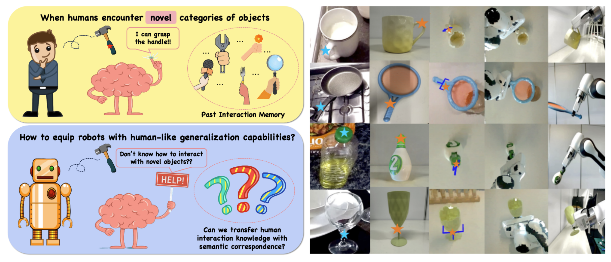
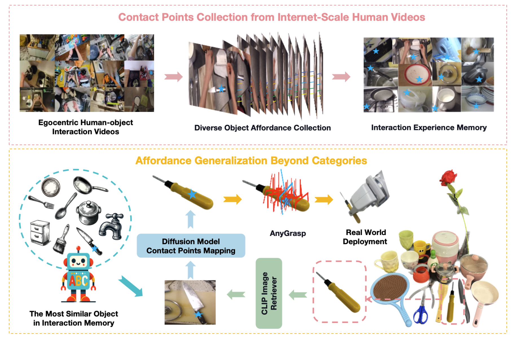

<h2 align="center">
  <b>Robo-ABC: Affordance Generalization Beyond Categories via Semantic Correspondence for Robot Manipulation</b>

  <b><i> ECCV 2024 </i></b>
</h2>

This is the official repository of [Robo-ABC: Affordance Generalization Beyond Categories via Semantic Correspondence for Robot Manipulation](https://arxiv.org/pdf/2401.07487).

    

# 🍒Pipeline

    

# TODO
- [ ] Release the semantic correspondence method code.
- [ ] Release the retriever code.
- [ ] Release the affordance memory extraction code.